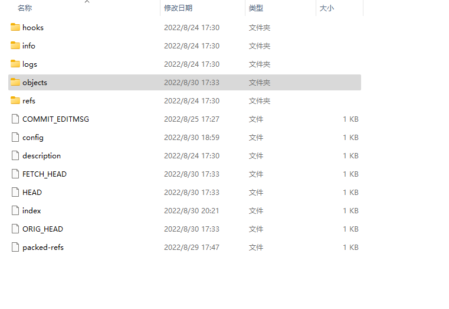

# 1.git目录
当在一个新目录或已有目录执行 git init 时，Git 会创建一个 .git 目录。 这个目录包含了几乎所有 Git 存储
和操作的东西。
每一个仓库下都有一个.git文件夹，这里面存放项目所有配置数据和所要管理的数据。重要的有几个文件，HEAD config objects refs

description 文件仅供 GitWeb 程序使用，我们无需关心。 config 文件包含项目特有的配置
选项。 info 目录包含一个全局性排除（global exclude）文件， 用以放置那些不希望被记录在 .gitignore
文件中的忽略模式（ignored patterns）。 hooks 目录包含客户端或服务端的钩子脚本（hook scripts），

剩下的四个条目很重要：HEAD 文件、（尚待创建的）index 文件，和 objects 目录、refs 目录。 它们都是
Git 的核心组成部分。 objects 目录存储所有数据内容；refs 目录存储指向数据（分支、远程仓库和标签等）
的提交对象的指针； HEAD 文件指向目前被检出的分支；index 文件保存暂存区信息。

Git 是一个内容寻址文件系统.Git 的核心部分是一个简单的键值
对数据库（key-value data store）。 你可以向 Git 仓库中插入任意类型的内容，它会返回一个唯一的键，通过
该键可以在任意时刻再次取回该内容。
可以通过底层命令 git hash-object 来演示上述效果——该命令可将任意数据保存于 .git/objects 目录
（即 对象数据库），并返回指向该数据对象的唯一的键。
git hash-object 会接受你传给它的东西，而它只会返回可以存储在 Git 仓库中的唯
一键.此命令输出一个长度为 40 个字符的校验和。 这是一个 SHA-1 哈希值——一个将待存储的数据外加一个头部信息
（header）一起做 SHA-1 校验运算而得的校验和。
如果你再次查看 objects 目录，那么可以在其中找到一个与新内容对应的文件。 这就是开始时 Git
存储内容的方式——一个文件对应一条内容， 以该内容加上特定头部信息一起的 SHA-1 校验和为文件命名。 校
验和的前两个字符用于命名子目录，余下的 38 个字符则用作文件名.
一旦你将内容存储在了对象数据库中，那么可以通过 cat-file 命令从 Git 那里取回数据。 这个命令简直就是
一把剖析 Git 对象的瑞士军刀。 为 cat-file 指定 -p 选项可指示该命令自动判断内容的类型，并为我们显示大
致的内容：
```shell
$ git cat-file -p d670460b4b4aece5915caf5c68d12f560a9fe3e4
test content
```
git cat-file -t 命令，可以让 Git 告诉我们其内部存储的任何对象类型，只要给定该对象
的 SHA-1 值：
```shell
$ git cat-file -t 1f7a7a472abf3dd9643fd615f6da379c4acb3e3a
blob
```
## 1.1 HEAD
head直译过来过来是头，这代表当前分支的引用。查看文件信息，得知当前处于哪个分支
```shell
cat HEAD
ref: refs/heads/master

$ git branch -av
  dev                   6e93b7c test rebase
* master                6e93b7c test rebase
  remotes/origin/master 6e93b7c test rebase
```
*代表当前分支
## 1.1 config
代表当前仓库的配置信息，其中包括仓库配置email和name,还有config的几种类型system、local、global
```shell
cat config

[core]
        repositoryformatversion = 0
        filemode = false
        bare = false
        logallrefupdates = true
        symlinks = false
        ignorecase = true
[remote "origin"]
        url = https://github.com/xxxx/xxxx.git
        fetch = +refs/heads/*:refs/remotes/origin/*
[branch "master"]
        remote = origin
        merge = refs/heads/master
[user]
        email = xxxxx@aliyun.com
        name = xxxx

```
## refs
