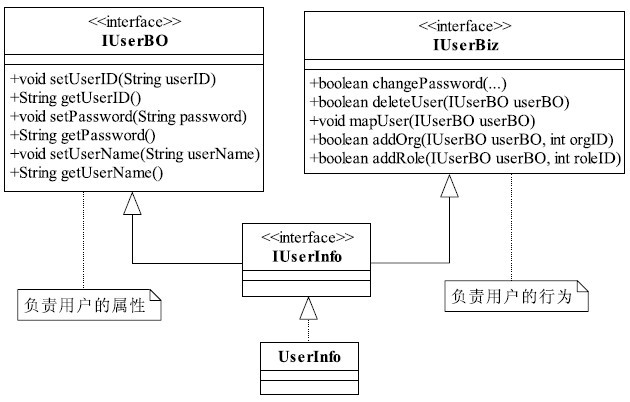
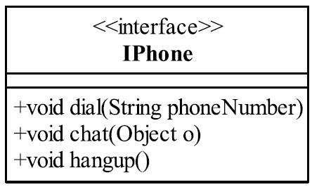

# 第1章　单一职责原则

单一职责原则的英文名称是Single Responsibility Principle，简称是SRP

，IUserBO的职责就是收集和反馈用户的属性信息；IUserBiz负责
用户的行为，完成用户信息的维护和变更.OK，我们现在是面向接口编程，所以产生了这个UserInfo对象之后，当然可以把它当
IUserBO接口使用。也可以当IUserBiz接口使用，这要看你在什么地方使用了。要获得用户信息，就当是IUserBO的实现类；要是
希望维护用户的信息，就把它当作IUserBiz的实现类就成了

There should never be more than one reason for a class to change.
单一职责原则要求一个接口或类只有一个原因引起变化，也就是一个接口或类只有一个职责，它就负责一件事情

IPhone这个接口可不是只有一个职责，它包含了两个职责：一个是协议管理，一个是数据传送。dial()和hangup()两个方法实现
的是协议管理，分别负责拨号接通和挂机；chat()实现的是数据的传送，把我们说的话转换成模拟信号或数字信号传递到对方，
然后再把对方传递过来的信号还原成我们听得懂的语言。我们可以这样考虑这个问题，协议接通的变化会引起这个接口或实现类
的变化吗？会的！那数据传送（想想看，电话不仅仅可以通话，还可以上网）的变化会引起这个接口或实现类的变化吗？会的！
那就很简单了，这里有两个原因都引起了类的变化。这两个职责会相互影响吗？电话拨号，我只要能接通就成，甭管是电信的还
是网通的协议；电话连接后还关心传递的是什么数据吗？通过这样的分析，我们发现类图上的IPhone接口包含了两个职责，而且
这两个职责的变化不相互影响，那就考虑拆分成两个接口，其类图如图1-5所示。

# 里氏替换原则

第一种定义，也是最正宗的定义：If for each object o1 of type S there is an object o2 of type T such that for all programs P defined in
terms of T,the behavior of P is unchanged when o1 is substituted for o2 then S is a subtype of T.（如果对每一个类型为S的对象o1，都有类型
为T的对象o2，使得以T定义的所有程序P在所有的对象o1都代换成o2时，程序P的行为没有发生变化，那么类型S是类型T的子类
型。）
● 第二种定义：Functions that use pointers or references to base classes must be able to use objects of derived classes without knowing it.
（所有引用基类的地方必须能透明地使用其子类的对象。）

只要父类能出现的地方子类就可以出现，而且替换为子类也不会产生任何错误或异
常，使用者可能根本就不需要知道是父类还是子类。但是，反过来就不行了，有子类出现的地方，父类未必就能适应

　在类中调用其他类时务必要使用父类或接口，如果不能使用父类或接口，则说明类的设计已经违背了LSP原则。

# 依赖倒置原则--面向接口编程”

依赖倒置原则（Dependence Inversion Principle,DIP）这个名字看着有点别扭，“依赖”还“倒置”，这到底是什么意思？依赖倒置
原则的原始定义是：
High level modules should not depend upon low level modules.Both should depend upon abstractions.Abstractions should not depend upon
details.Details should depend upon abstractions.
翻译过来，包含三层含义：
● 高层模块不应该依赖低层模块，两者都应该依赖其抽象；
● 抽象不应该依赖细节；
● 细节应该依赖抽象。
高层模块和低层模块容易理解，每一个逻辑的实现都是由原子逻辑组成的，不可分割的原子逻辑就是低层模块，原子逻辑的
再组装就是高层模块。那什么是抽象？什么又是细节呢？在Java语言中，抽象就是指接口或抽象类，两者都是不能直接被实例化
的；细节就是实现类，实现接口或继承抽象类而产生的类就是细节，其特点就是可以直接被实例化，也就是可以加上一个关键字
new产生一个对象。依赖倒置原则在Java语言中的表现就是：
● 模块间的依赖通过抽象发生，实现类之间不发生直接的依赖关系，其依赖关系是通过接口或抽象类产生的；
● 接口或抽象类不依赖于实现类；
● 实现类依赖接口或抽象类。

在Java中，只要定义变量就必然要有类型，一个变量可以有两种类型：表面类型和实际类型，表面类型是在定义的时
候赋予的类型，实际类型是对象的类型，如zhangSan的表面类型是IDriver，实际类型是Driver。

抽象是对实现的约束，对依赖者而言，也是一种契约，不仅仅约束自己，还同时约束自己与外部的关系，其目的是保证所有
的细节不脱离契约的范畴，确保约束双方按照既定的契约（抽象）共同发展，只要抽象这根基线在，细节就脱离不了这个圈圈，
始终让你的对象做到“言必信，行必果”。

依赖倒置原则的本质就是通过抽象（接口或抽象类）使各个类或模块的实现彼此独立，不互相影响，实现模块间的松耦合，
我们怎么在项目中使用这个规则呢？只要遵循以下的几个规则就可以：
● 每个类尽量都有接口或抽象类，或者抽象类和接口两者都具备
这是依赖倒置的基本要求，接口和抽象类都是属于抽象的，有了抽象才可能依赖倒置。
● 变量的表面类型尽量是接口或者是抽象类
很多书上说变量的类型一定要是接口或者是抽象类，这个有点绝对化了，比如一个工具类，xxxUtils一般是不需要接口或是抽
象类的。还有，如果你要使用类的clone方法，就必须使用实现类，这个是JDK提供的一个规范。
● 任何类都不应该从具体类派生
如果一个项目处于开发状态，确实不应该有从具体类派生出子类的情况，但这也不是绝对的，因为人都是会犯错误的，有时
设计缺陷是在所难免的，因此只要不超过两层的继承都是可以忍受的。特别是负责项目维护的同志，基本上可以不考虑这个规
则，为什么？维护工作基本上都是进行扩展开发，修复行为，通过一个继承关系，覆写一个方法就可以修正一个很大的Bug，何
必去继承最高的基类呢？（当然这种情况尽量发生在不甚了解父类或者无法获得父类代码的情况下。）
● 尽量不要覆写基类的方法
如果基类是一个抽象类，而且这个方法已经实现了，子类尽量不要覆写。类间依赖的是抽象，覆写了抽象方法，对依赖的稳
定性会产生一定的影响。
● 结合里氏替换原则使用
在第2章中我们讲解了里氏替换原则，父类出现的地方子类就能出现，再结合本章的讲解，我们可以得出这样一个通俗的规
则： 接口负责定义public属性和方法，并且声明与其他对象的依赖关系，抽象类负责公共构造部分的实现，实现类准确的实现业
务逻辑，同时在适当的时候对父类进行细化。

# 第4章　接口隔离原则
● Clients should not be forced to depend upon interfaces that they don't use.（客户端不应该依赖它不需要的接口。）
● The dependency of one class to another one should depend on the smallest possible interface.（类间的依赖关系应该建立在最小的接
口上。）
先说第一种定义：“客户端不应该依赖
它不需要的接口”，那依赖什么？依赖它需要的接口，客户端需要什么接口就提供什么接口，把不需要的接口剔除掉，那就需要
对接口进行细化，保证其纯洁性；再看第二种定义：“类间的依赖关系应该建立在最小的接口上”，它要求是最小的接口，也是要
求接口细化，接口纯洁，与第一个定义如出一辙，只是一个事物的两种不同描述。

我们可以把这两个定义概括为一句话：建立单一接口，不要建立臃肿庞大的接口。再通俗一点讲：接口尽量细化，同时接口
中的方法尽量少。看到这里大家有可能要疑惑了，这与单一职责原则不是相同的吗？错，接口隔离原则与单一职责的审视角度是
不相同的，单一职责要求的是类和接口职责单一，注重的是职责，这是业务逻辑上的划分，而接口隔离原则要求接口的方法尽量
少。

接口隔离原则是对接口进行规范约束，其包含以下4层含义：
● 接口要尽量小
接口要高内聚 ？高内聚就是提高接口、类、模块的处理能力，减少对外的交互 
具体到接口隔离原则就是，要求在接口中尽量少公布public方
法，接口是对外的承诺，承诺越少对系统的开发越有利，变更的风险也就越少，同时也有利于降低成本。
定制服务
接口设计是有限度的

接口隔离原则是对接口的定义，同时也是对类的定义，接口和类尽量使用原子接口或原子类来组装。但是，这个原子该怎么
划分是设计模式中的一大难题，在实践中可以根据以下几个规则来衡量：
● 一个接口只服务于一个子模块或业务逻辑；
● 通过业务逻辑压缩接口中的public方法，接口时常去回顾，尽量让接口达到“满身筋骨肉”，而不是“肥嘟嘟”的一大堆方法；
● 已经被污染了的接口，尽量去修改，若变更的风险较大，则采用适配器模式进行转化处理；
● 了解环境，拒绝盲从。每个项目或产品都有特定的环境因素，别看到大师是这样做的你就照抄。千万别，环境不同，接口
拆分的标准就不同。深入了解业务逻辑，最好的接口设计就出自你的手中！
接口隔离原则和其他设计原则一样，都需要花费较多的时间和精力来进行设计和筹划，但是它带来了设计的灵活性，让你可
以在业务人员提出“无理”要求时轻松应付。贯彻使用接口隔离原则最好的方法就是一个接口一个方法，保证绝对符合接口隔离原
则（有可能不符合单一职责原则），但你会采用吗？不会，除非你是疯子！那怎么才能正确地使用接口隔离原则呢？答案是根据
经验和常识决定接口的粒度大小，接口粒度太小，导致接口数据剧增，开发人员呛死在接口的海洋里；接口粒度太大，灵活性降
低，无法提供定制服务，给整体项目带来无法预料的风险。
# 第5章　迪米特法则

迪米特法则（Law of Demeter，LoD）也称为最少知识原则（Least Knowledge Principle，LKP），虽然名字不同，但描述的是同
一个规则：一个对象应该对其他对象有最少的了解

