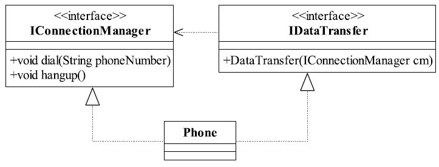
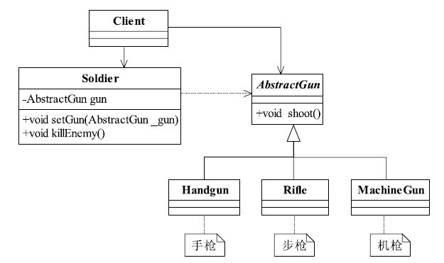

# 第1章　单一职责原则

单一职责原则的英文名称是Single Responsibility Principle，简称是SRP

，IUserBO的职责就是收集和反馈用户的属性信息；IUserBiz负责
用户的行为，完成用户信息的维护和变更.OK，我们现在是面向接口编程，所以产生了这个UserInfo对象之后，当然可以把它当
IUserBO接口使用。也可以当IUserBiz接口使用，这要看你在什么地方使用了。要获得用户信息，就当是IUserBO的实现类；要是
希望维护用户的信息，就把它当作IUserBiz的实现类就成了

There should never be more than one reason for a class to change.
单一职责原则要求一个接口或类只有一个原因引起变化，也就是一个接口或类只有一个职责，它就负责一件事情

IPhone这个接口可不是只有一个职责，它包含了两个职责：一个是协议管理，一个是数据传送。dial()和hangup()两个方法实现
的是协议管理，分别负责拨号接通和挂机；chat()实现的是数据的传送，把我们说的话转换成模拟信号或数字信号传递到对方，
然后再把对方传递过来的信号还原成我们听得懂的语言。我们可以这样考虑这个问题，协议接通的变化会引起这个接口或实现类
的变化吗？会的！那数据传送（想想看，电话不仅仅可以通话，还可以上网）的变化会引起这个接口或实现类的变化吗？会的！
那就很简单了，这里有两个原因都引起了类的变化。这两个职责会相互影响吗？电话拨号，我只要能接通就成，甭管是电信的还
是网通的协议；电话连接后还关心传递的是什么数据吗？通过这样的分析，我们发现类图上的IPhone接口包含了两个职责，而且
这两个职责的变化不相互影响，那就考虑拆分成两个接口，其类图如图1-5所示。

# 里氏替换原则

第一种定义，也是最正宗的定义：If for each object o1 of type S there is an object o2 of type T such that for all programs P defined in
terms of T,the behavior of P is unchanged when o1 is substituted for o2 then S is a subtype of T.（如果对每一个类型为S的对象o1，都有类型
为T的对象o2，使得以T定义的所有程序P在所有的对象o1都代换成o2时，程序P的行为没有发生变化，那么类型S是类型T的子类
型。）
● 第二种定义：Functions that use pointers or references to base classes must be able to use objects of derived classes without knowing it.
（所有引用基类的地方必须能透明地使用其子类的对象。）

只要父类能出现的地方子类就可以出现，而且替换为子类也不会产生任何错误或异
常，使用者可能根本就不需要知道是父类还是子类。但是，反过来就不行了，有子类出现的地方，父类未必就能适应

　在类中调用其他类时务必要使用父类或接口，如果不能使用父类或接口，则说明类的设计已经违背了LSP原则。

# 依赖倒置原则--面向接口编程”

依赖倒置原则（Dependence Inversion Principle,DIP）这个名字看着有点别扭，“依赖”还“倒置”，这到底是什么意思？依赖倒置
原则的原始定义是：
High level modules should not depend upon low level modules.Both should depend upon abstractions.Abstractions should not depend upon
details.Details should depend upon abstractions.
翻译过来，包含三层含义：
● 高层模块不应该依赖低层模块，两者都应该依赖其抽象；
● 抽象不应该依赖细节；
● 细节应该依赖抽象。
高层模块和低层模块容易理解，每一个逻辑的实现都是由原子逻辑组成的，不可分割的原子逻辑就是低层模块，原子逻辑的
再组装就是高层模块。那什么是抽象？什么又是细节呢？在Java语言中，抽象就是指接口或抽象类，两者都是不能直接被实例化
的；细节就是实现类，实现接口或继承抽象类而产生的类就是细节，其特点就是可以直接被实例化，也就是可以加上一个关键字
new产生一个对象。依赖倒置原则在Java语言中的表现就是：
● 模块间的依赖通过抽象发生，实现类之间不发生直接的依赖关系，其依赖关系是通过接口或抽象类产生的；
● 接口或抽象类不依赖于实现类；
● 实现类依赖接口或抽象类。

